[](https://www.python.org/downloads/release/python-390/)
[](https://github.com/karlvbiron/MATRIX/releases)
[](https://opensource.org/licenses/MIT)
[](https://github.com/karlvbiron/MATRIX/issues)
[](https://www.levelblue.com/blogs/spiderlabs-blog/lights-out-and-stalled-factories-using-matrix-to-learn-about-modbus-vulnerabilities/)

## Featured Technical Article
📝 **[Lights Out and Stalled Factories: Using M.A.T.R.I.X to Learn About Modbus Vulnerabilities](https://www.levelblue.com/blogs/spiderlabs-blog/lights-out-and-stalled-factories-using-matrix-to-learn-about-modbus-vulnerabilities/)**
Check out the LevelBlue SpiderLabs technical article that demonstrates M.A.T.R.I.X in action against a vulnerable Modbus TCP server dockerized target. The article provides detailed walkthroughs of each attack module, complete with practical examples and security insights tailored to industrial control systems in the energy and manufacturing sectors. A must-read for anyone looking to understand the practical applications of this tool in ICS security testing.


# M.A.T.R.I.X

**Modbus Attack Tool for Remote Industrial eXploitation**

M.A.T.R.I.X is a comprehensive security testing tool for Modbus TCP protocol implementations. It provides multiple attack modules for security research and penetration testing of industrial control systems.

> ⚠️ **WARNING**: This tool is designed for authorized security testing only. Using this tool against systems without proper permission is illegal and unethical.

> 🆕 **New in v2:** M.A.T.R.I.X now includes configurable register/coil ranges, MITRE ATT&CK for ICS mappings, and an optional local web dashboard. The command-line workflow below is unchanged and fully backward-compatible. See [What's New in v2](#whats-new-in-v2) for the additions.

## Features

M.A.T.R.I.X includes the following attack modules:

- **Unauthorized Read**: Scans and reads values from Modbus registers and coils
- **Coil Attack**: Unauthorized writes to coil registers
- **Register Attack**: Unauthorized writes to holding registers
- **Overflow Attack**: Tests for integer overflow vulnerabilities
- **DoS Attack**: Denial of Service attack through connection flooding
- **Replay Attack**: Captures and replays Modbus traffic
- **Spoof Attack**: Spoofs Modbus responses with falsified data

## Installation

1. Clone the repository:
   ```
   git clone https://github.com/karlvbiron/MATRIX.git
   cd MATRIX
   ```

2. Set up the virtual environment (optional but recommended):
   ```
   python3 -m venv venv
   source venv/bin/activate  # On Windows, use 'venv\Scripts\activate'
   ```

3. Install dependencies:
   ```
   pip install -r requirements.txt
   ```

4. Ensure you have proper permissions for packet operations (for spoof and replay attacks):
   ```
   sudo apt-get install libpcap-dev  # On Debian/Ubuntu
   ```

> 💡 The web dashboard has its own optional dependencies. If you plan to use it, also run `pip install -r requirements-web.txt`. See [The Web Dashboard](#the-web-dashboard-optional).

## Usage

M.A.T.R.I.X Help Output:

Banner ASCII Font: [ANSI Shadow](https://patorjk.com/software/taag/#p=display&f=ANSI%20Shadow&t=MATRIX)

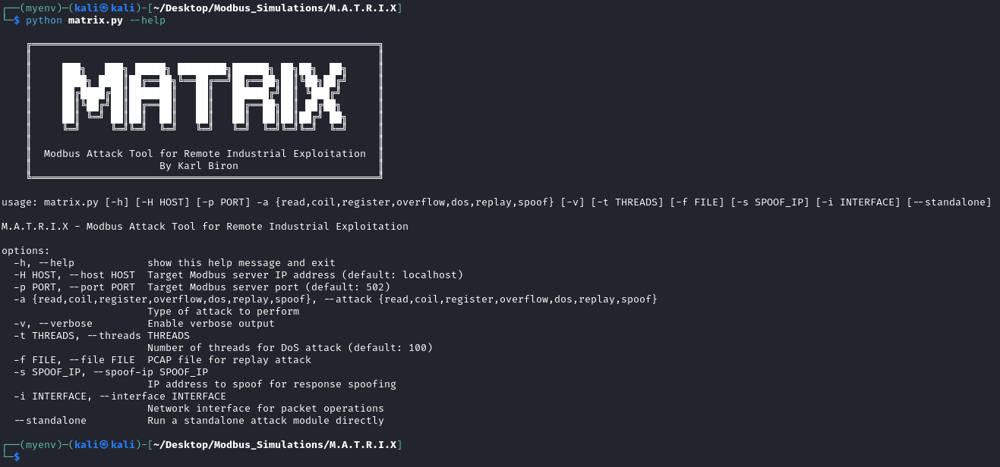

Basic usage:
```
python matrix.py -H <target_ip> -p <port> -a <attack_type>
```

Attack types:
- `read`: Unauthorized read operation
- `coil`: Coil register write attack
- `register`: Holding register write attack
- `overflow`: Register overflow attack
- `dos`: Denial of Service attack
- `replay`: Traffic replay attack
- `spoof`: Response spoofing attack

### Examples

Perform unauthorized read on a local Modbus server:
```
python matrix.py -H localhost -p 502 -a read
```

Launch DoS attack with 50 threads:
```
python matrix.py -H 192.168.1.10 -p 502 -a dos -t 50
```

Replay Modbus traffic from a PCAP file:
```
python matrix.py -H 192.168.1.10 -p 502 -a replay -f captured_traffic.pcap
```

Spoof Modbus responses:
```
python matrix.py -H 192.168.1.10 -p 502 -a spoof -s 192.168.1.20 -i docker0
```

> 🆕 The `read`, `coil`, `register`, and `overflow` modules also accept `--start`, `--count`, and `--unit-id` to target arbitrary address windows. See [Configurable Register and Coil Ranges](#1-configurable-register-and-coil-ranges).

## Project Structure

```
matrix/
├── matrix.py                                      # Main tool script
├── requirements.txt                               # Dependencies
├── requirements-web.txt                           # Optional web dashboard dependencies
├── README.md                                      # Documentation
├── attacks/                                       # Attack modules
│   ├── __init__.py                                # Package initialization
│   ├── modbus_unauthorized_read.py                # Unauthorized read module
│   ├── modbus_coil_write_attack.py                # Coil attack module
│   ├── modbus_holding_registers_write_attack.py   # Register attack module
│   ├── modbus_overflow_attack.py                  # Overflow attack module
│   ├── modbus_dos_attack.py                       # DoS attack module
│   ├── modbus_replay_attack.py                    # Replay attack module
│   ├── modbus_spoof_response.py                   # Response spoofing module
│   ├── attack_result.py                           # Shared structured result object
│   ├── attack_mapping.py                          # MITRE ATT&CK for ICS mappings
│   ├── formatter.py                               # Console output formatting
│   └── validation.py                              # Modbus parameter validation
├── webapp/                                        # Optional web dashboard (FastAPI)
└── tests/                                         # Test suite
```

## Architecture

The M.A.T.R.I.X tool is designed with a modular architecture that separates the command-line interface from the individual attack modules. This section provides insights into the tool's structure through class diagrams, package organization, and attack workflow visualization.

### Class Diagram


> 📌 This diagram depicts the original (v1) class architecture. In v2, each attack class additionally exposes a callable `execute()` method returning an `AttackResult` object (see [What's New in v2](#whats-new-in-v2)); the original methods shown here are preserved for backward compatibility.

The class diagram illustrates the object-oriented architecture of M.A.T.R.I.X:

- **MatrixCLI**: The central command-line interface class that processes user arguments and orchestrates the execution of attack modules.
  - Contains methods for parsing arguments, displaying help information, and initializing attack modules.
  - Manages the execution flow and reporting of results.

- **Attack Modules**: Each specialized attack functionality is encapsulated in its own class:
  - **ModbusUnauthorizedReader**: Implements functions for scanning and reading values from Modbus registers and coils without authorization.
  - **ModbusUnauthorizedCoilWriter**: Contains methods for unauthorized manipulation of coil states.
  - **ModbusUnauthorizedHoldingRegisterWriter**: Handles unauthorized writing to holding registers.
  - **ModbusOverflowAttacker**: Implements methods to test for integer overflow vulnerabilities in Modbus implementations.
  - **ModbusReplayAttacker**: Provides functionality to capture, analyze, and replay Modbus traffic for attack simulation.
  - **ModbusResponseSpoofer**: Implements methods to craft and send falsified Modbus responses.
  - **ModbusDosAttacker**: Contains methods for executing denial-of-service attacks through connection flooding.

Each attack module inherits common attributes like host IP, port, and ModbusTcpClient instances, while implementing unique attack functionality through specialized methods.

### Package Structure


> 📌 This diagram depicts the original (v1) package structure and its three core dependencies. v2 adds the `webapp/` package, a `tests/` suite, and several `attacks/` support modules (`attack_mapping.py`, `attack_result.py`, `formatter.py`, `validation.py`), along with optional web dependencies listed in `requirements-web.txt` (see [What's New in v2](#whats-new-in-v2)).

The package organization of M.A.T.R.I.X follows a logical structure:

- **The M.A.T.R.I.X Project** (Yellow container): The overall project boundary.
  - **matrix.py**: The main CLI interface file that serves as the entry point for the tool.
  - **README.md**: Documentation for the project.
  - **requirements.txt**: Lists the project dependencies.

- **The 'attacks' Folder** (Orange container): Contains all attack module implementations.
  - **__init__.py**: Package initialization file that enables importing from the attacks package.
  - **Individual attack modules**: Seven Python files implementing specific attack functionalities.

- **External Dependencies** (Blue container): Shows the third-party libraries required by the project.
  - **pymodbus**: Primary library for Modbus protocol implementation.
  - **scapy**: Used for packet manipulation in spoofing and replay attacks.
  - **tabulate**: Provides formatted table output for better readability of results.

The arrows between components represent import relationships, showing how the modules connect and depend on each other.

### Attack Workflows


> 📌 This diagram depicts the original (v1) attack workflows. The underlying attack logic is unchanged in v2; the additions (configurable ranges, ATT&CK mapping, and the web dashboard) layer on top of these workflows rather than altering them (see [What's New in v2](#whats-new-in-v2)).

The workflow diagram outlines the execution process for each attack type:

- **Unauthorized Read Attack**:
  - Connects to the target Modbus server
  - Sequentially reads values from coils, discrete inputs, holding registers, and input registers
  - Reports the discovered information

- **Unauthorized Coils/Registers Write Attack**:
  - Establishes a connection to the target
  - Writes unauthorized values to coils or registers
  - Reads back the changed values to verify the attack was successful
  - Confirms changes were applied to the target system

- **DoS Attack**:
  - Initializes multiple threads for concurrent connections
  - Creates numerous connections to the target
  - Floods the server with Modbus requests
  - Continuously monitors target response to determine impact

- **Replay Attack**:
  - Loads captured Modbus traffic from a PCAP file
  - Extracts and analyzes Modbus packet structures
  - Replays captured request packets to the target
  - Compares original and new responses to identify discrepancies

- **Spoof Attack**:
  - Crafts custom Modbus responses with falsified data
  - Sets the source address to match a legitimate Modbus server
  - Sends the spoofed packets to the target
  - Observes system behavior to assess impact

All attack workflows conclude with a comprehensive results report.

### Implementation Notes

The modular design allows for:
- Easy extension with new attack modules
- Independent testing and development of individual attack types
- Consistent interface across different attack functionalities
- Simplified maintenance and updates

## Design Pattern

M.A.T.R.I.X follows the [Command pattern](https://www.oreilly.com/library/view/head-first-design/9781492077992/ch06.html), where each attack module encapsulates a specific action with a consistent execution interface. This design allows the main program to invoke different attacks without knowing their specific implementation details.

Key aspects of the Command pattern implementation:
- Each attack module represents a command with methods like `run_test()`, `launch_attack()`, or `run_comprehensive_scan()`
- The main program (`matrix.py`) acts as the invoker that selects and executes the appropriate command
- All commands share similar initialization parameters (host, port) for consistent interface
- Each command encapsulates all the logic needed for its specific attack type

This design makes it easy to add new attack types without modifying existing code, adhering to the Open/Closed Principle.

> 🆕 In v2, each attack module additionally exposes a callable `execute()` method that returns a structured `AttackResult` object, allowing the same attack logic to drive both the command line and the web dashboard from a single code path. Console output is handled by a separate formatting layer, so the CLI behavior remains identical to v1.

## Dependencies

M.A.T.R.I.X relies on the following key dependencies:

- **pymodbus**: Core library for Modbus TCP protocol communication, used for reading and writing to Modbus registers and coils
- **scapy**: Powerful packet manipulation library used for crafting custom packets in spoof attacks and analyzing PCAP files in replay attacks
- **tabulate**: Used to create formatted tables for displaying attack results in a readable format

Additional system requirements:
- **libpcap-dev**: Required for the packet capture functionality used in replay and spoof attacks
- **Root privileges**: Required for sending raw packets in spoofing attacks and capturing packets in replay attacks

## Advanced Usage

### Standalone Mode

Some attack modules can be run in standalone mode with elevated privileges:

```
sudo python matrix.py -H 192.168.1.10 -p 502 -a replay --standalone -f traffic.pcap
```

```
sudo python matrix.py -H 192.168.1.10 -p 502 -a spoof --standalone -s 192.168.1.20 -i eth0
```

Standalone mode is particularly useful for attacks that require root privileges or direct system access.

---

## What's New in v2

Version 2 expands M.A.T.R.I.X from a fixed command-line demonstration into a more flexible and legible teaching and research instrument. **All original functionality and command-line usage is preserved and backward-compatible.** The additions below are layered on top of the existing tool.

Three additions:

1. **[Configurable register and coil ranges](#1-configurable-register-and-coil-ranges)**, target arbitrary address windows instead of hardcoded ones.
2. **[MITRE ATT&CK for ICS mapping](#2-mitre-attck-for-ics-mapping)**, every module tagged to a recognized technique.
3. **[An optional web dashboard](#3-the-web-dashboard-optional)**, a local, browser-based console with a live state monitor.

### 1. Configurable Register and Coil Ranges

The `read`, `coil`, `register`, and `overflow` modules now accept explicit address-window parameters instead of operating only on hardcoded ranges:

- `--start`, the starting Modbus address
- `--count`, how many coils or registers to act on
- `--unit-id`, the Modbus unit/device identifier

Defaults reproduce the original behavior exactly, so existing commands are unaffected. For example, to read a specific window:

```
python matrix.py -a read -H 127.0.0.1 -p 502 --start 2 --count 2
```

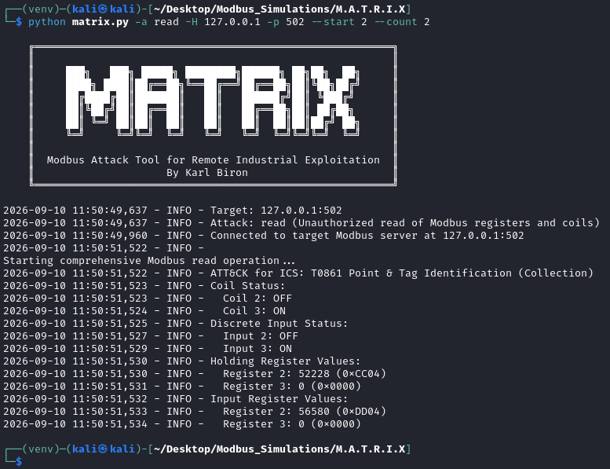

Parameters are validated against Modbus protocol limits (for example, a single request may read at most 2000 coils or 125 registers, and addresses are bounded to the 16-bit space) **before any packet is sent**. An out-of-range request is rejected with a clear message rather than emitting a malformed request:

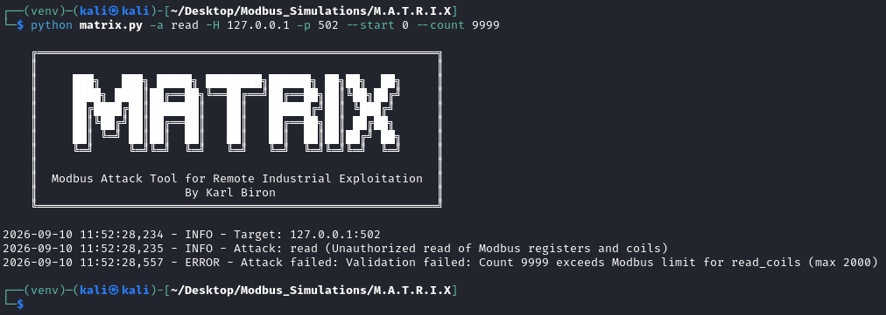

### 2. MITRE ATT&CK for ICS Mapping

Each attack module is now mapped to the [MITRE ATT&CK for ICS](https://attack.mitre.org/matrices/ics/) technique it most closely represents. Mappings are defined in one central, version-stamped location (`attacks/attack_mapping.py`) and, at the time of writing, target **ATT&CK for ICS v19.2**. Where a technique's identifier changed in a recent framework revision, the prior (legacy) identifier is recorded alongside the current one.

Run `--list-mappings` to print the full coverage matrix as a table (or as machine-readable JSON with `--output json`). Each row lists a module alongside its technique ID, technique name, tactic, and any legacy ID:

```
python matrix.py --list-mappings
```

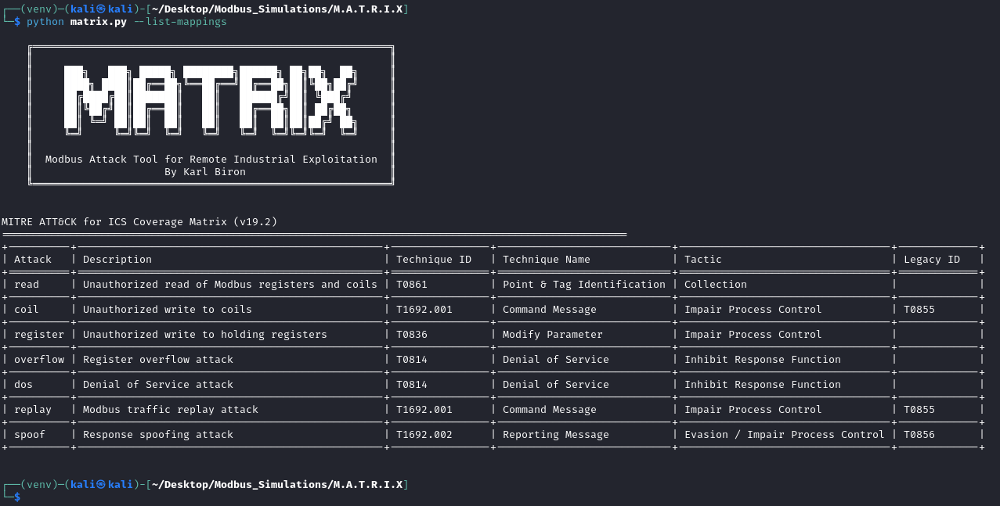

Each attack also annotates its own output with its technique ID as it runs, so the framing travels with the result:

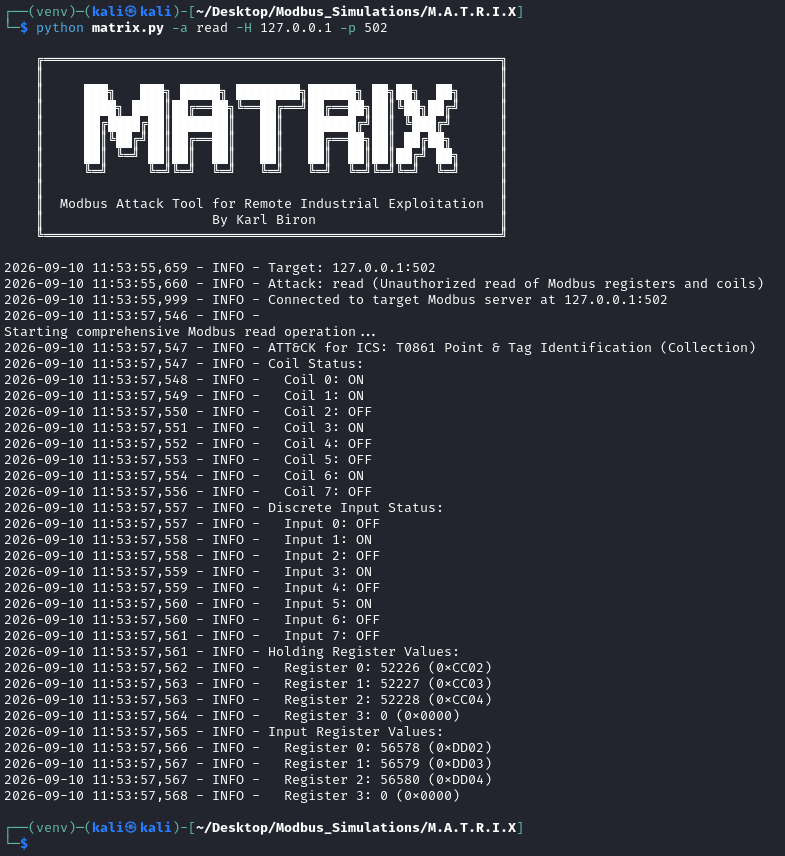

The current mapping is below (two of these, `read` and `overflow`, are judgment calls rather than exact matches):

| Module | Technique (ATT&CK for ICS v19.2) | Tactic |
| --- | --- | --- |
| `read` | Point & Tag Identification | Collection |
| `coil` | Command Message (Unauthorized Message) | Impair Process Control |
| `register` | Modify Parameter | Impair Process Control |
| `overflow` | Denial of Service | Inhibit Response Function |
| `dos` | Denial of Service | Inhibit Response Function |
| `replay` | Command Message (Unauthorized Message) | Impair Process Control |
| `spoof` | Reporting Message (Unauthorized Message) | Evasion / Impair Process Control |

### 3. The Web Dashboard (optional)

An optional local, browser-based dashboard orchestrates the same attack modules used by the command line and adds a live, operator-style state monitor. It is a demonstration and teaching console, **not** an operations platform.

Install the web dependencies and launch it:

```
pip install -r requirements-web.txt
python matrix.py --web
```

By default the dashboard binds to `127.0.0.1:8000` (loopback only). A browser interface that can issue ICS write commands should not be reachable across a network by accident, so exposure beyond the local machine is an explicit, opt-in choice. In the same spirit, the most disruptive modules (`dos`, `replay`, and `spoof`) are gated behind the `MATRIX_WEB_ENABLE_DANGEROUS=1` environment variable before they can be triggered from the browser.

**Attacks view.** Each module is rendered as a card with its real parameters and ATT&CK tag. Read operations are styled as safe; destructive write operations are styled as dangerous, so the difference between "observe" and "alter" is legible at a glance:

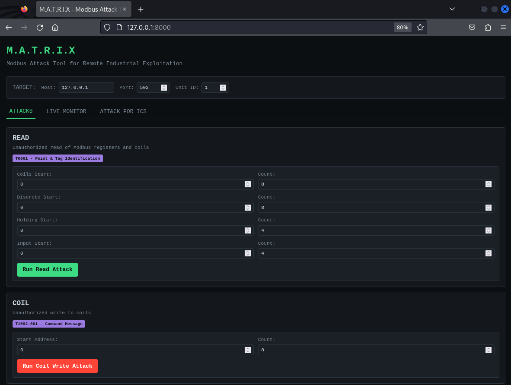

Running a module returns its structured result inline:

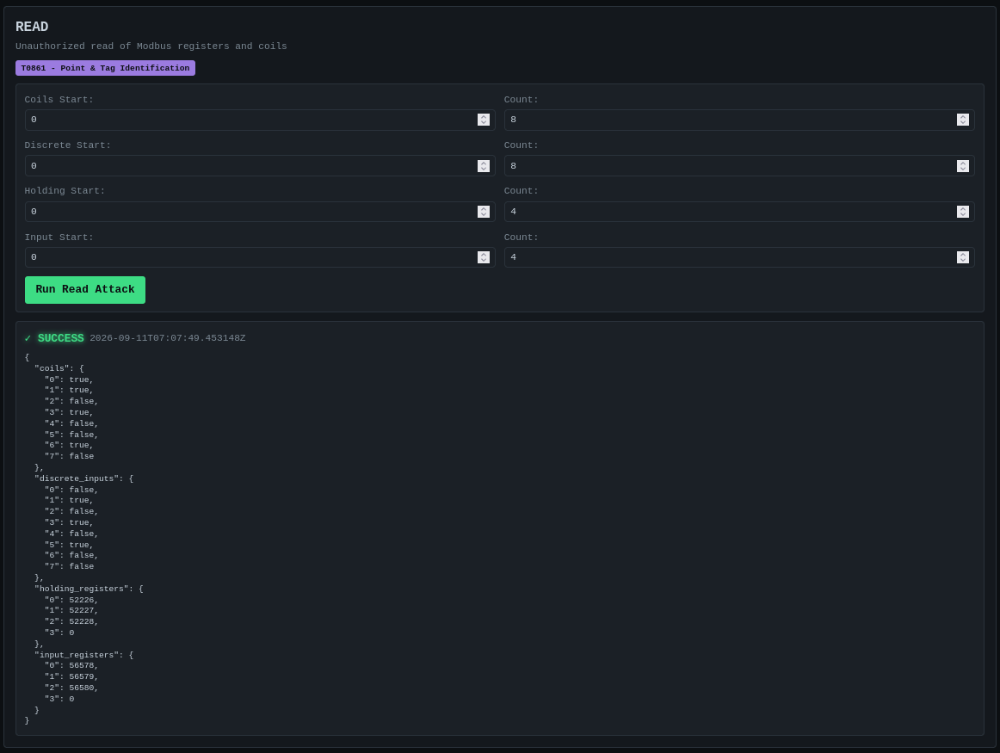

**Live Monitor.** This opens a streaming connection and continuously polls a chosen window of coils and holding registers, rendering coils as an indicator (LED) grid and holding registers as decimal/hex value cells:

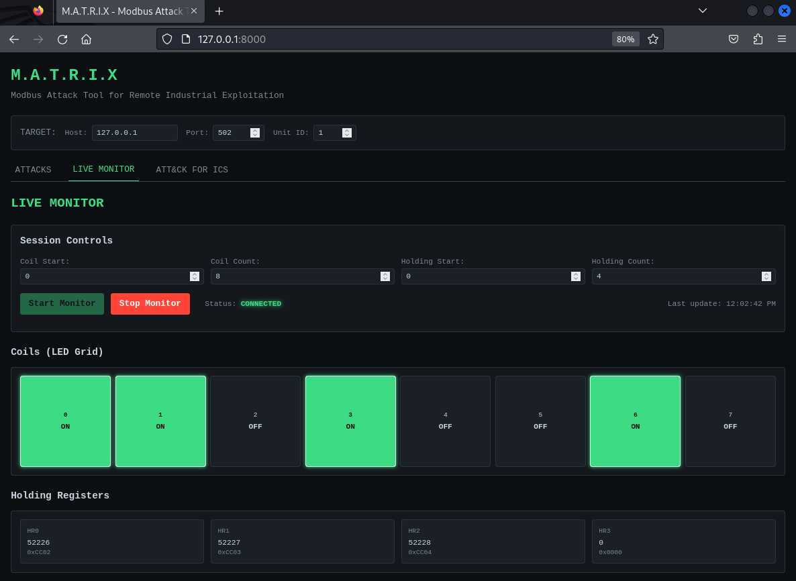

Paired with an attack, the monitor makes manipulation visible in real time. When a coil-write is fired against the target, the affected cells are briefly flagged in red as they flip:

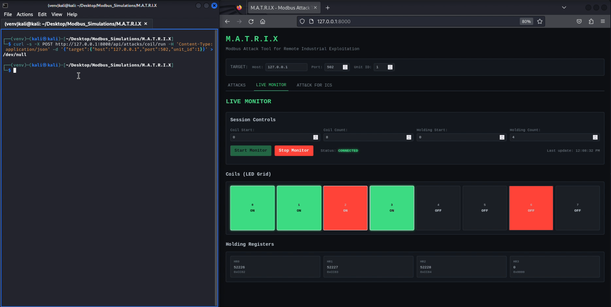

**ATT&CK for ICS view.** This renders the coverage matrix in the browser as a reference alongside the live attacks:

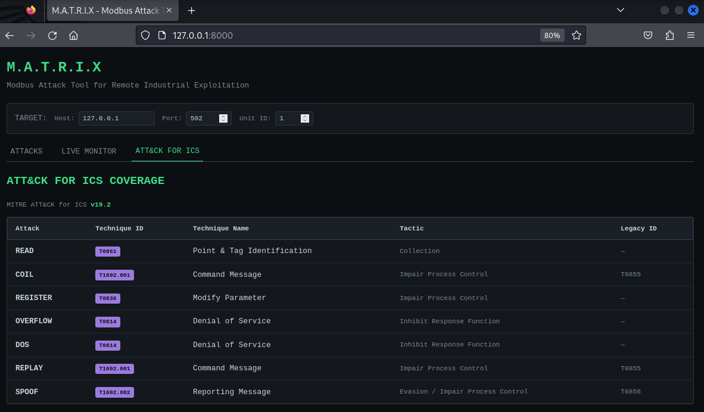

#### Dashboard architecture

The dashboard reuses the shared attack modules in-process (no subprocess), so there is a single source of truth for what each attack does:

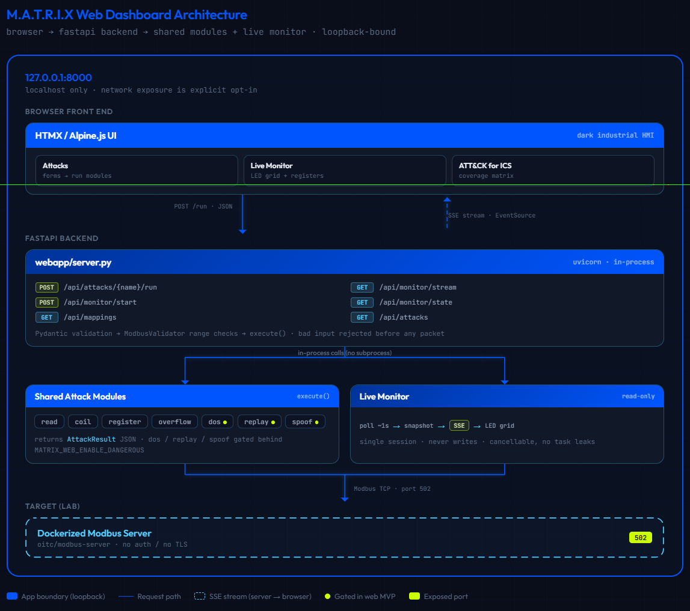

The live monitor runs a read-only poll → stream → render loop; a separate attack alters the target and surfaces on the same panel:

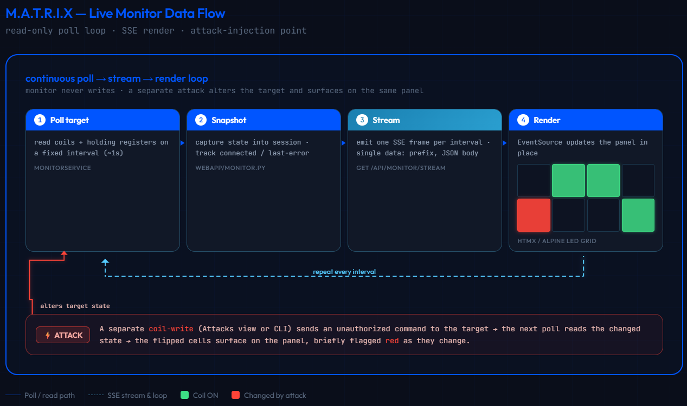

### v2 Limitations

In the spirit of the original article, it is worth being candid about what v2 does not do:

- **Still lab-bound.** Everything here was built and exercised against the same Dockerized `oitc/modbus-server` target. It has not been validated against real PLCs or other simulators, and its behavior outside this environment is untested. Configurable ranges make the tool *aimable* in principle, but that is not the same as *verified* against arbitrary hardware.
- **The dashboard is single-target, single-session.** No historical storage, no multi-user support, and no authentication beyond the loopback binding. It should never be exposed beyond a controlled lab.
- **The most impactful modules remain the most constrained.** As in v1, the overflow attack is blunted by the Python target's strict type enforcement, and the spoofing module's full effect cannot be observed against this target. These are limitations of the safe test environment.
- **The ATT&CK mapping involves judgment.** Two of the seven mappings are explicit judgment calls, and the identifiers are pinned to one framework version and will need maintenance as ATT&CK evolves.
- **"Live" is not real-time in the industrial sense.** The monitor polls on an interval and streams snapshots.

---

## Legal Disclaimer

This tool is provided for educational and authorized testing purposes only. Users are responsible for obtaining proper authorization before testing any systems. The authors accept no liability for misuse of this software.

## License

This project is licensed under the MIT License, meaning you are free to use, modify, and distribute it under proper ethical guidelines.

## Authors
* **Karl Biron** - follow me on LinkedIn and GitHub - [karlbiron](https://www.linkedin.com/in/karlbiron/) and [karlvbiron](https://github.com/karlvbiron/MATRIX)

## Contribute
If you have ideas or features you'd like to contribute, feel free to open a Pull Request. Otherwise, you can reach out to me directly on LinkedIn [karlbiron](https://www.linkedin.com/in/karlbiron/).
